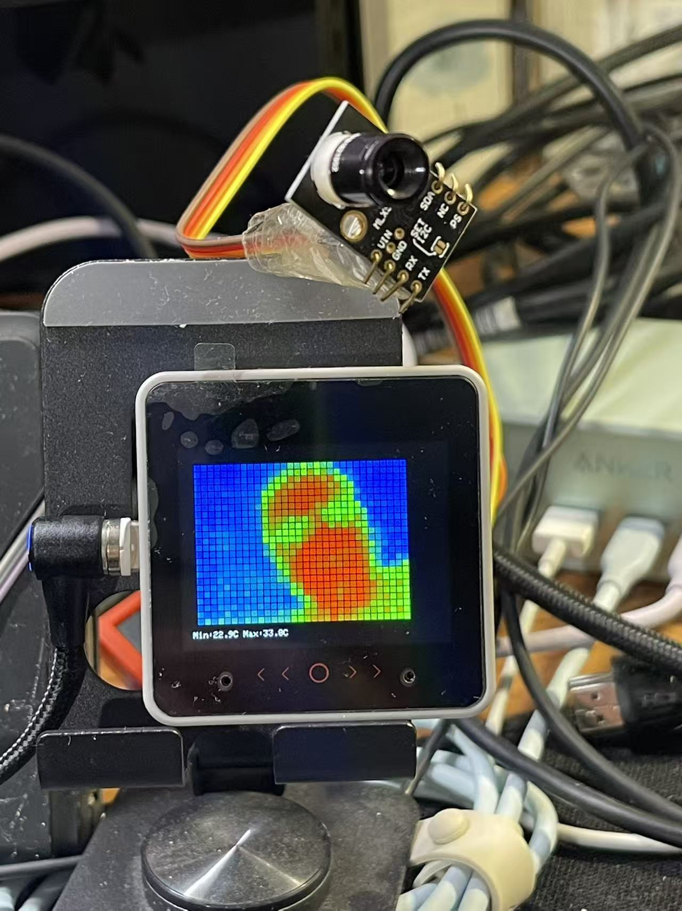

# GYMCU90640 红外摄像头项目 (UART模式)

基于 M5Stack CoreS3 的 GYMCU90640 (MLX90640) 红外阵列摄像头 UART 通信示例，支持自动波特率扫描、协议帧多长度兼容、热力图显示与调试原始数据输出。

## 硬件要求

- M5Stack CoreS3 SE 开发板
- GYMCU90640 红外摄像头模块 (MLX90640 + UART 转接板)
- 杜邦线若干

## 产品特性

- **芯片**: MLX90640 红外温度传感器阵列
- **分辨率**: 32×24 像素 (768 点)
- **温度范围**: -40°C ~ 300°C
- **精度**: ±1°C (视标定与环境)
- **视角**: 55°×35° (型号不同略有差异)
- **工作电压**: 3–5V（实测 5V 更稳定）
- **通信**: UART (TTL) + I2C (芯片原生接口)

## 接线说明

```
GYMCU90640  ->    M5Stack CoreS3
VIN         ->    5V   (*实测接 5V 方可稳定输出完整帧，3.3V 下常出现字节不足*)
GND         ->    GND
TX          ->    GPIO 44 (模块发送 → CoreS3 接收)
RX          ->    GPIO 43 (可选，用于发送命令)
```

**注意**:
- 最简只需 VIN / GND / TX→G44；若需发送控制命令再加 RX→G43。
- 自动扫描波特率：9600 / 115200 / 460800，选收到字节最多者。
- 建议使用 5V 供电；如果只能 3.3V，需降低帧率并延长捕获窗口。

## 功能特性

- 自动波特率扫描与选择
- 多协议帧 declaredLen 支持 (1536 / 1538 / 1540)
- 早期帧检测与捕获窗口可调 (`MLX_CAPTURE_WINDOW_MS`)
- 实时温度统计：Min / Max / Center / 模块环境温度 (可选字段)
- 热力图渲染（颜色渐变：蓝→绿→红）
- 原始数据模式分析 (统计 0x5A / 0x00 出现频率)
- 解析失败自动回退模拟数据，方便界面测试
- 按钮交互：采集、热力图、自动输出开关、帧率循环切换

## 按钮功能

- BtnA 短按：采集一帧并显示数值
- BtnA 长按 (>1.5s)：输出原始 HEX + ASCII 调试
- BtnB 短按：显示热力图
- BtnB 长按 (>1.5s)：循环切换帧率 (0.5Hz→1Hz→2Hz→4Hz→8Hz)
- BtnC 短按：切换自动输出开/关

## 依赖库

- M5CoreS3 (M5Stack 官方库)
> UART 模式不依赖专用 MLX90640 I2C 库，所有解析为本项目内置逻辑。

## 编译和上传

```pwsh
pio run --target upload
```

## 串口监视器

```pwsh
pio device monitor
```

## 配置说明 & 宏

主要可调宏（位于 `src/main.cpp`）：
- `MLX_CAPTURE_WINDOW_MS`：串口捕获时间窗口 (默认 3500ms)
- `MLX_EARLY_STOP_ENABLED`：检测到完整帧即提前结束 (1=启用)
- `USE_STRICT_PROTOCOL`：严格校验模式 (0=关闭)

可在 `include/config.h` 中继续扩展：初始自动输出开关、默认帧率、窗口配色等。

## UART 协议与解析逻辑

典型连续帧结构（经验推断）：
```
0x5A 0x5A LEN_L LEN_H [1536 像素字节] [可选: 2 模块温度] [2 校验]
```
支持的 declaredLen：
- 1536：仅像素 + 校验
- 1538：像素 + 模块温度 + 校验
- 1540：兼容变体（像素 + 模块温度 + 填充 + 校验）

像素为 16-bit 小端原始值，初始缩放 `raw/100.0`；若离谱则尝试 `raw/16.0`，最后必要时进行 K→C 转换减 273.15。

## 温度数据格式与显示

- 32×24 = 768 像素
- 统计最小、最大、中心点 (16,12) 温度
- 若帧包含模块温度字段则显示环境温度 `Env`。

## 故障排除

1. **字节量过少 (<1500)**：确认供电改为 5V；增大 `MLX_CAPTURE_WINDOW_MS`；检查 TX 引脚。
2. **解析失败**：查看 HEX 输出（BtnA 长按），确认是否存在连续 0x5A 0x5A 帧头；必要时添加新的 declaredLen。
3. **温度值异常**：尝试更换缩放方式；加黑体标定表。
4. **热力图单色**：等待模组稳定或调节帧率降低噪声；检查颜色映射范围。
5. **波特率扫描无数据**：强制 `mlxSerial.begin(115200, ...)` 测试；检查接地与线缆长度。

## 扩展功能想法

- 超限报警 / 蜂鸣器 / 背光闪烁
- 云端上传 / WebSocket 推送实时热图
- 帧间差分 / 平滑滤波 / 噪声抑制
- 多区域 ROI 平均温度输出
- OTA 升级 / 远程参数调节
- 标定工具：采样黑体多点拟合校准曲线

欢迎提交 Issue 或 PR 改进协议兼容与性能。

---
版权所有 © 2025